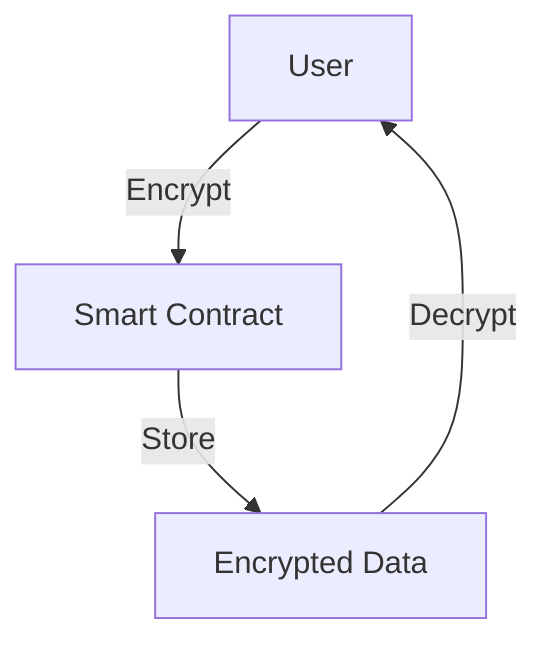

# GitBook Documentation Structure

## Overview
This document outlines the GitBook-compatible documentation structure for the Anonymous Identity Verification FHEVM example project.

## Table of Contents Structure

```yaml
# book.json or SUMMARY.md structure

Introduction:
  - README.md (Project Overview)
  - Getting Started
  - Quick Start Guide

Fundamentals:
  - What is FHEVM
  - Privacy-Preserving Smart Contracts
  - Homomorphic Encryption Basics
  - Key Concepts

Tutorials:
  - Hello FHEVM Tutorial
    - HELLO_FHEVM_TUTORIAL.md
  - Building Your First FHE Contract
  - Testing FHE Contracts
  - Deploying to Testnet

Core Concepts:
  - Access Control
    - FHE.allow() and FHE.allowThis()
    - Permission Management
    - User-Specific Access
  - Input Proofs
    - What are Input Proofs
    - Why They're Needed
    - Using Input Proofs Correctly
  - Encryption Patterns
    - Single Value Encryption
    - Multiple Value Encryption
    - Data Type Selection
  - User Decryption
    - Enabling User Decryption
    - Batch Decryption
    - Selective Disclosure

Examples:
  - Basic Examples
    - FHE Counter
    - Arithmetic Operations
    - Comparison Operations
  - Encryption Examples
    - Single Value Encryption
    - Multiple Value Encryption
    - Encryption Patterns
  - Access Control Examples
    - Role-Based Control
    - User Permissions
    - Decryption Rights
  - User Decryption Examples
    - Single Value Decryption
    - Multiple Value Decryption
    - Selective Decryption
  - Input Proof Examples
    - Validating User Input
    - Multiple Proof Validation
    - Proof Verification Patterns
  - Anti-Patterns
    - Common Mistakes
    - How to Avoid Them
    - Best Practices

Contract Reference:
  - Anonymous Identity Verification
    - Overview
    - Functions
    - Events
    - Structs
  - Example Contracts
    - FHECounter
    - EncryptionExample
    - AccessControlExample
    - UserDecryptionExample
    - InputProofExample
    - AntiPatternsExample

Best Practices:
  - Security Patterns
  - Privacy Design
  - Code Organization
  - Testing Strategies
  - Gas Optimization
  - Error Handling

Development:
  - Developer Guide
  - Automation Tools
  - Adding New Features
  - Maintenance Workflows
  - Version Management

Deployment:
  - Deployment Guide
  - Environment Setup
  - Network Configuration
  - Contract Verification
  - Monitoring

Technical Details:
  - Technical Architecture
  - Data Flow
  - Encryption Model
  - Verification Algorithm
  - Security Analysis

Resources:
  - External Documentation
  - Community Resources
  - Support Channels
  - Contributing Guidelines
```

## File Mapping

### Introduction
```
docs/
├── README.md                          → Project Overview
├── getting-started.md                 → Getting Started Guide
└── quick-start.md                     → Quick Start Tutorial
```

### Fundamentals
```
docs/fundamentals/
├── what-is-fhevm.md                  → FHEVM Introduction
├── privacy-contracts.md               → Privacy-Preserving Contracts
├── homomorphic-encryption.md          → HE Basics
└── key-concepts.md                    → Key Concepts
```

### Tutorials
```
docs/tutorials/
├── HELLO_FHEVM_TUTORIAL.md           → Main Tutorial
├── first-contract.md                  → Building First Contract
├── testing.md                         → Testing Guide
└── deployment.md                      → Deployment Tutorial
```

### Core Concepts
```
docs/concepts/
├── access-control/
│   ├── overview.md
│   ├── fhe-allow.md
│   └── permissions.md
├── input-proofs/
│   ├── overview.md
│   ├── why-needed.md
│   └── usage.md
├── encryption/
│   ├── single-value.md
│   ├── multiple-values.md
│   └── patterns.md
└── user-decryption/
    ├── overview.md
    ├── batch-decryption.md
    └── selective-disclosure.md
```

### Examples
```
docs/examples/
├── basic/
│   ├── fhe-counter.md
│   ├── arithmetic.md
│   └── comparison.md
├── encryption/
│   ├── single-value-encryption.md
│   ├── multiple-value-encryption.md
│   └── encryption-patterns.md
├── access-control/
│   ├── role-based-control.md
│   ├── user-permissions.md
│   └── decryption-rights.md
├── user-decryption/
│   ├── single-value-decryption.md
│   ├── multiple-value-decryption.md
│   └── selective-decryption.md
├── input-proofs/
│   ├── validating-user-input.md
│   ├── multiple-proof-validation.md
│   └── proof-patterns.md
└── anti-patterns/
    ├── common-mistakes.md
    ├── how-to-avoid.md
    └── best-practices.md
```

### Contract Reference
```
docs/contracts/
├── anonymous-identity-verification/
│   ├── overview.md
│   ├── functions.md
│   ├── events.md
│   └── structs.md
└── examples/
    ├── fhe-counter.md
    ├── encryption-example.md
    ├── access-control-example.md
    ├── user-decryption-example.md
    ├── input-proof-example.md
    └── anti-patterns-example.md
```

### Best Practices
```
docs/best-practices/
├── BEST_PRACTICES.md                 → Main Guide
├── security-patterns.md
├── privacy-design.md
├── code-organization.md
├── testing-strategies.md
├── gas-optimization.md
└── error-handling.md
```

### Development
```
docs/development/
├── DEVELOPER_GUIDE.md                → Developer Guide
├── AUTOMATION_GUIDE.md               → Automation Tools
├── adding-features.md
├── maintenance.md
└── version-management.md
```

### Deployment
```
docs/deployment/
├── DEPLOYMENT_GUIDE.md               → Deployment Guide
├── environment-setup.md
├── network-configuration.md
├── contract-verification.md
└── monitoring.md
```

### Technical Details
```
docs/technical/
├── TECHNICAL_ARCHITECTURE.md         → Architecture Guide
├── data-flow.md
├── encryption-model.md
├── verification-algorithm.md
└── security-analysis.md
```

## GitBook Configuration

### book.json
```json
{
  "title": "FHEVM Anonymous Identity Verification",
  "description": "Complete guide to privacy-preserving identity verification using FHEVM",
  "author": "FHEVM Development Team",
  "language": "en",
  "gitbook": ">=3.2.0",
  "root": "./docs",
  "structure": {
    "readme": "README.md",
    "summary": "SUMMARY.md"
  },
  "plugins": [
    "github",
    "code",
    "mermaid-gb3",
    "expandable-chapters",
    "search-plus",
    "prism",
    "-highlight",
    "copy-code-button",
    "splitter",
    "theme-comscore"
  ],
  "pluginsConfig": {
    "github": {
      "url": "https://github.com/fhevm-examples/anonymous-identity-verification"
    },
    "sharing": {
      "facebook": false,
      "twitter": true,
      "google": false,
      "all": ["twitter", "github"]
    }
  },
  "links": {
    "sidebar": {
      "Zama Documentation": "https://docs.zama.ai/fhevm",
      "GitHub Repository": "https://github.com/fhevm-examples/anonymous-identity-verification"
    }
  }
}
```

### SUMMARY.md
```markdown
# Summary

## Introduction
* [Overview](README.md)
* [Getting Started](getting-started.md)
* [Quick Start](quick-start.md)

## Fundamentals
* [What is FHEVM](fundamentals/what-is-fhevm.md)
* [Privacy-Preserving Contracts](fundamentals/privacy-contracts.md)
* [Homomorphic Encryption](fundamentals/homomorphic-encryption.md)
* [Key Concepts](fundamentals/key-concepts.md)

## Tutorials
* [Hello FHEVM](tutorials/HELLO_FHEVM_TUTORIAL.md)
* [Building Your First Contract](tutorials/first-contract.md)
* [Testing FHE Contracts](tutorials/testing.md)
* [Deploying to Testnet](tutorials/deployment.md)

## Core Concepts
* [Access Control](concepts/access-control/overview.md)
  * [FHE.allow and FHE.allowThis](concepts/access-control/fhe-allow.md)
  * [Permission Management](concepts/access-control/permissions.md)
* [Input Proofs](concepts/input-proofs/overview.md)
  * [Why Input Proofs](concepts/input-proofs/why-needed.md)
  * [Using Input Proofs](concepts/input-proofs/usage.md)
* [Encryption Patterns](concepts/encryption/patterns.md)
* [User Decryption](concepts/user-decryption/overview.md)

## Examples
* [Basic Examples](examples/basic/fhe-counter.md)
* [Encryption Examples](examples/encryption/single-value-encryption.md)
* [Access Control Examples](examples/access-control/role-based-control.md)
* [User Decryption Examples](examples/user-decryption/single-value-decryption.md)
* [Input Proof Examples](examples/input-proofs/validating-user-input.md)
* [Anti-Patterns](examples/anti-patterns/common-mistakes.md)

## Contract Reference
* [Anonymous Identity Verification](contracts/anonymous-identity-verification/overview.md)
* [Example Contracts](contracts/examples/fhe-counter.md)

## Best Practices
* [Overview](best-practices/BEST_PRACTICES.md)
* [Security Patterns](best-practices/security-patterns.md)
* [Privacy Design](best-practices/privacy-design.md)
* [Gas Optimization](best-practices/gas-optimization.md)

## Development
* [Developer Guide](development/DEVELOPER_GUIDE.md)
* [Automation Tools](development/AUTOMATION_GUIDE.md)
* [Adding Features](development/adding-features.md)

## Deployment
* [Deployment Guide](deployment/DEPLOYMENT_GUIDE.md)
* [Environment Setup](deployment/environment-setup.md)
* [Monitoring](deployment/monitoring.md)

## Technical Details
* [Architecture](technical/TECHNICAL_ARCHITECTURE.md)
* [Data Flow](technical/data-flow.md)
* [Security Analysis](technical/security-analysis.md)

## Resources
* [External Documentation](resources/external-docs.md)
* [Community Resources](resources/community.md)
* [Contributing](resources/contributing.md)
```

## Metadata Tags

Each markdown file should include metadata:

```markdown
---
title: Page Title
description: Brief description
chapter: category-name
example: true/false
difficulty: beginner/intermediate/advanced
concepts: [concept1, concept2]
---
```

## Cross-References

Use consistent linking format:

```markdown
See [Access Control](../concepts/access-control/overview.md) for details.
Refer to the [FHECounter Example](../examples/basic/fhe-counter.md).
```

## Code Blocks

Use language-specific code blocks:

```markdown
\`\`\`solidity
// Solidity code
\`\`\`

\`\`\`javascript
// JavaScript code
\`\`\`

\`\`\`bash
# Shell commands
\`\`\`
```

## Diagrams

Use Mermaid for diagrams:



## Navigation

Include navigation at bottom of each page:

```markdown
---
**Previous:** [Previous Page](previous.md)
**Next:** [Next Page](next.md)
**Up:** [Table of Contents](../README.md)
```

---

**GitBook Structure Version**: 1.0
**Last Updated**: December 2025
**Status**: Production Ready
